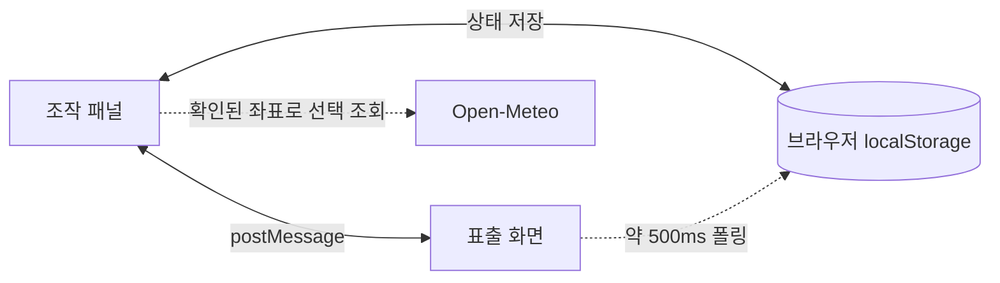

<!-- markdownlint-disable MD013 MD033 -->

# STAY UP 현장 상황판

<p align="center">
  <strong>실종자 수색 현장의 드론·인원·수색구역·안전정보를 한 화면에 모으는 단일 HTML 상황판</strong>
</p>

<p align="center">
  
  
  
  
  
</p>

<p align="center">
  <a href="https://github.com/MuyeongKim/stayup-dash/archive/refs/heads/main.zip"><strong>Download ZIP</strong></a>
  ·
  <a href="#빠른-시작">빠른 시작</a>
  ·
  <a href="#현재-검증-상태">검증 상태</a>
</p>

<p align="center">
  
</p>

<p align="center"><sub>샘플 데이터로 실행한 1600×900 표출 화면 · 실제 인물·출동 정보가 아닙니다.</sub></p>

STAY UP은 현장 조작자가 입력한 내용을 같은 PC의 대형 모니터에 즉시 반영하는 오프라인 우선 대시보드입니다. 앱 실행에 설치·빌드·CDN은 필요하지 않으며, 선택적인 자동 기상 조회만 인터넷을 사용합니다.

> [!CAUTION]
> **현재 버전은 훈련·시연 및 개발 검증용이며, 실출동 단독 운용 승인 전입니다.** 2026-08-23 Chrome 실행 감사에서 입력 유실, 상태와 이벤트 불일치, 편집권·복구·완전삭제 메시지 경계 문제가 확인됐습니다. 아래 [현재 검증 상태](#현재-검증-상태)를 해결하고 대상 PC·브라우저·스피커에서 인수시험을 마치기 전에는 현장 지휘나 비행 판단의 단일 근거로 사용하지 마십시오.

## 무엇을 한 화면에 모으나

- **상황 개요** — 출동시각, CP, 좌표, TRS 채널, 호출부호, 지휘부 지시
- **실종자 정보** — 인상착의, 최종목격, 특이사항, 이동 추정반경
- **드론 운용** — 기체 상태, 배터리, 담당구역, 고도, 조종·관측, 소티
- **수색구역** — 최대 12×12 격자, 상태·담당, 지도 이미지, 최종목격·발견 핀
- **안전·기상** — 승인, 야간, 유인기 경보, 풍속·돌풍·강수, 일출·일몰
- **활동기록** — 발생시각 기반 타임라인, 정정·취소, JSON 백업, 활동일지 복사

상단 KPI는 실종 후 경과, 일몰, 입력된 안전조건에 따른 비행 판정, 출동 경과를 보여줍니다. 배터리 지속시간과 이동 반경은 입력값을 이용한 **계획 보조용 근사치**이며 실제 텔레메트리나 GIS 분석이 아닙니다.

## 작동 구조



- 조작 패널과 표출 화면은 **동일 PC·동일 브라우저 저장영역**을 사용합니다.
- 창이 직접 연결돼 있으면 `postMessage`, 연결이 끊기면 `localStorage` 폴링으로 상태를 따라갑니다.
- 서버, 로그인, 클라우드 동기화, 기관 간 네트워크 공유는 제공하지 않습니다.
- 자동 기상을 켜면 위·경도가 Open-Meteo 요청에 포함됩니다. 성명·지도·이벤트를 전송하는 기능은 없습니다.

## 빠른 시작

### 비개발자

1. [ZIP 파일](https://github.com/MuyeongKim/stayup-dash/archive/refs/heads/main.zip)을 내려받아 압축을 풉니다.
2. `stayup-dash.html`을 **Chrome 또는 Edge**로 엽니다.
3. 새 브라우저 프로필에서 기능을 볼 때만 `샘플 상황 넣기`를 사용합니다.
4. `표출 화면 열기`를 누르고 새 창을 대형 화면으로 옮깁니다.
5. 표출 창의 `🔊 경보음 준비`를 눌러 시험음과 출력 장치를 확인합니다.

> 운영 데이터가 이미 있다면 샘플을 넣기 전에 반드시 JSON을 내보내십시오. 현재 샘플 적용은 복구점 저장 실패 시에도 진행될 수 있습니다.

### Git으로 받기

```bash
git clone https://github.com/MuyeongKim/stayup-dash.git
cd stayup-dash
```

macOS에서는 다음처럼 Chrome으로 직접 열 수 있습니다.

```bash
open -a "Google Chrome" stayup-dash.html
```

## 기본 운용 흐름

1. 상단의 `편집권 보유`, 저장 상태, 표출 연결 상태를 확인합니다.
2. 상황명·수색 장소·출동시각과 위·경도를 입력하고 `현장 좌표 확인 완료`를 누릅니다.
3. 실종자, 기체, 배터리, 인원, 수색격자를 입력합니다.
4. 승인상태와 현장 기상 관측시각·풍속·돌풍·강수를 확인합니다.
5. 기체 전용 버튼과 격자 셀로 실제 상태를 변경하고 이벤트를 기록합니다.
6. 종료 전 JSON을 내보내 실제 파일 생성 여부를 확인하고 활동일지를 복사합니다.
7. 공용 PC에서는 개인정보 완전삭제 후 **열린 관련 창을 모두 닫고**, 다운로드·USB·스크린샷·클립보드 사본도 별도로 정리합니다.

화면이 하나뿐이면 표출 화면에서 `Ctrl+E`로 조작 드로어를 열 수 있습니다. 다른 조작 창이 편집권을 보유하면 드로어는 읽기 전용입니다.

## 비행 판정 규칙

| 표시 | 조건 예시 |
| --- | --- |
| `판정 보류` | 좌표 미입력·미확인, 승인 미확인·미신청·신청중, 기상 미확정·필수값 누락·30분 경과, 태양시각 계산 불가 |
| `제한 비행` | 풍속·돌풍이 각 한계의 80% 이상, 강수확률 60% 이상, 승인된 야간, 일몰 30분 전 |
| `비행 불가` | 유인기 진입, 관제권·비행금지구역 승인 미완료, 한계 이상 풍속·돌풍, 현재 강수, 야간승인 없는 야간 |
| `비행 가능` | 위 보류·주의·불가 조건이 없을 때 |

> [!IMPORTANT]
> 화면의 판정은 입력값을 계산한 보조 표시입니다. 드론을 제어하거나 공역·NOTAM·유인기를 자동 감지하지 않으며, 현장 지휘·관계 법령·실제 승인·제작사 제한·현장 계측을 대체하지 않습니다.

현재 `동시 운용 인접기관`은 노란 표시만 만들고 중앙 판정에는 포함되지 않습니다. 또한 인원 명부의 조종자와 기체의 조종자 문자열은 연결돼 있지 않아 교대 종료가 기체 판정을 제한하지 않습니다.

### 유인기·발견 경보

- `⚠ 유인기 진입`은 화면을 적색으로 바꾸고 비행 불가와 즉시 착륙 지시 문구를 표시하지만, 실제 기체 상태나 비행을 제어하지 않습니다.
- `발견` 이벤트는 표출 화면에 배너를 띄우고 준비된 Web Audio 경보음을 재생합니다.
- 브라우저 자동재생 정책 때문에 표출 창을 열 때마다 사용자가 `경보음 준비`를 눌러야 합니다.

## 수색격자와 지도

- 기본 상태 모드에서 클릭·터치·`Enter`·`Space`로 `미수색 → 수색중 → 완료 → 재수색`을 순환합니다.
- 담당 모드에서는 상태 대신 `드론 / 지상 / 수색견 / 소방대` 담당을 바꿉니다.
- 마우스 `Shift+클릭`은 담당을 빠르게 순환합니다.
- 지도 이미지는 파일 선택, 드래그앤드롭, 클립보드 붙여넣기로 넣을 수 있습니다.
- 가로 1,600px를 넘는 이미지는 최대 1,600px로 축소하고 JPEG 품질 0.82로 저장합니다. HEIC은 브라우저에서 열리지 않을 수 있습니다.
- 이동 추정반경은 사용자가 입력한 지도 가로거리에 맞춘 근사 표시이며 좌표계·지형을 보정하지 않습니다.

| 환경 | 클립보드 캡처 |
| --- | --- |
| macOS | `⌘ + Control + Shift + 4` 후 `⌘V` |
| Windows | `Win + Shift + S` 후 `Ctrl+V` |

macOS의 `⌘ + Shift + 4`는 기본적으로 파일을 저장합니다. 이 경우 저장된 이미지를 끌어다 놓거나 `이미지 파일 선택…`을 사용합니다.

## 기상과 일출·일몰

- 일출·일몰은 확인된 좌표로 브라우저에서 계산합니다. 좌표가 없을 때 다른 지역을 대신 사용하지 않습니다.
- 자동 기상은 확인된 좌표와 인터넷이 있을 때 10분마다 Open-Meteo 모델값을 조회합니다.
- 자동값도 `현장 기상 확인 완료` 전에는 비행 판정에 사용하지 않습니다.
- 관측시각이 정확히 30분에 도달하면 기상은 만료되고 판정을 보류합니다.
- 수동 기상을 입력하면 자동 덮어쓰기를 중지하며, 진행 중이던 늦은 자동응답도 수동값을 덮어쓰지 않습니다.
- Open-Meteo 값은 현장 풍속계나 공식 관측·승인을 대신하지 않습니다.

## 저장·백업·개인정보

| 항목 | 동작과 한계 |
| --- | --- |
| 브라우저 저장 | 현재 브라우저 프로필의 `localStorage`에 평문 저장 |
| 자동 복구 | 변경 상태를 30초 주기로 최대 5개 보조 복구본에 저장. 서로 다른 5개 시점을 보장하지 않음 |
| JSON 내보내기 | 상태·이벤트·지도 포함. 다른 위치에 보관할 수 있는 주 백업 수단 |
| JSON 불러오기 | 지원 버전·필수 구조·지도 data URL 외형을 검사. 실제 손상 이미지 디코딩까지 보장하지 않음 |
| 활동일지 복사 | 상황·기체·수색·인원·이벤트·안전정보를 텍스트로 정리해 클립보드에 복사 |
| 완전삭제 | 브라우저의 `stayup.dash.*` 데이터 제거. 다운로드·USB·스크린샷·클립보드 사본은 제거하지 않음 |

> [!WARNING]
> 로그인, 암호화, 권한 분리, 서버 백업, 변조방지 감사로그는 없습니다. 파일명·경로 변경, 브라우저 변경, `file://`과 로컬 HTTP 전환은 저장영역을 바꿀 수 있으므로 먼저 JSON을 내보내십시오. 완전삭제 후에는 이전 상태 메시지 재유입을 막기 위해 관련 창을 모두 닫으십시오.

## 현재 검증 상태

실제 Chrome 실행 감사에서 다음 항목은 정상 확인했습니다.

- 초기 공란의 `판정 보류`, 야간·일몰 경계, 승인 상태, 풍속·돌풍 한계, 기상 30분 만료
- 지연된 자동응답의 수동 기상 보호와 실제 Open-Meteo 응답 파싱
- JSON 구조·버전 거부, 낮은 revision 가져오기 승격, 지도 저장 실패 롤백
- 발견 배너·경보음 준비·확인 동기화, 키보드 격자 조작
- 1,440×900·1,600×900 표출과 390px 조작 화면의 수평 오버플로 없음
- Google Chrome 151에서 `file://` 직접 부팅

다음 문제는 **현장 운용 전 차단 항목**입니다.

1. 일반 입력의 `change`가 조작 패널 전체를 다시 그려 연속 입력이나 다음 버튼의 첫 조작이 유실될 수 있습니다.
2. 빠른기록의 `이륙·착륙·구역완료·인원교대`는 이벤트만 추가하고 기체·격자·인원 상태를 함께 바꾸지 않습니다.
3. 15초 편집권이 모달·절전 등으로 만료되면 같은 창이 자동으로 회복하지 못할 수 있습니다.
4. 복구 적용 전 스냅샷이나 샘플 적용 전 복구점 저장 실패가 덮어쓰기를 중단시키지 않습니다.
5. 완전삭제 후 오래된 epoch 상태 메시지를 표출 화면이 다시 받아들일 수 있습니다.
6. 이벤트 발생시각 기본값은 입력줄이 렌더된 시각이므로 오래 열린 입력줄에서는 기록 전 시각을 다시 확인해야 합니다.
7. 비행 중 기체 조종자의 교대 종료와 인접기관 공역조정 상태가 중앙 비행 판정에 연결되지 않습니다.

물리 스피커 음량, Edge, 기관 업무망 정책, 실제 듀얼 모니터와 장시간 절전·복귀는 대상 장비에서 별도 인수시험이 필요합니다.

## 데이터 한계

| 항목 | 한계 |
| --- | ---: |
| 이벤트 | 5,000건 |
| JSON 입력 파일 | 6 MiB 이하. 브라우저 잔여 저장공간에 따라 더 작은 파일도 실패 가능 |
| 지도 data URL | 약 3 MiB 이하 |
| 격자 | 최대 12×12 |
| 드론 | 불러오기·재시작 정규화 기준 50대 |
| 인원 | 불러오기·재시작 정규화 기준 200명 |
| 기상 유효시간 | 관측 후 30분 미만 |
| 자동 기상 | 10분 주기, 요청 12초 타임아웃 |
| 편집권 | 15초 임대, 5초 갱신 |
| 표출 연결 | 마지막 응답 후 7초에 미연결 표시 |

## 단축키

| 키 | 표출 화면 동작 |
| --- | --- |
| `F` | 전체화면 켜기·끄기 |
| `Ctrl+E` | 조작 드로어 열기·닫기 |
| `Esc` | 조작 드로어 닫기 |
| `+` / `-` | 표출 배율 조절 |

## 개발자 메모

런타임은 [stayup-dash.html](./stayup-dash.html) 하나이며 라이브러리·CDN·npm·빌드 의존성이 없습니다. 로컬 미리보기는 다음처럼 실행할 수 있습니다.

```bash
python3 -m http.server 8899 --bind 127.0.0.1
```

브라우저에서 `http://127.0.0.1:8899/stayup-dash.html`을 엽니다. 로컬 HTTP와 `file://`은 저장영역이 다를 수 있으므로 운영 데이터와 혼용하지 마십시오.

인라인 스크립트 구문만 빠르게 확인하려면 Node.js가 있는 환경에서 다음을 실행할 수 있습니다.

```bash
node -e "const fs=require('fs');const s=fs.readFileSync('stayup-dash.html','utf8');const m=s.match(/<script>([\s\S]*?)<\/script>/);if(!m)throw Error('script missing');new Function(m[1]);console.log('inline script syntax: OK')"
```

### 자동 버전 정책

- [VERSION](./VERSION)이 앱 릴리스 버전의 기준이며 [stayup-dash.html](./stayup-dash.html)의 `APP_VERSION`과 항상 같아야 합니다.
- 사용자가 `main`에 업데이트를 푸시할 때마다 GitHub Actions가 기본적으로 패치 버전을 올립니다. 예: `v1.0.1 → v1.0.2`.
- 커밋 메시지에 `[부버전]`을 넣으면 minor, `[주버전]`을 넣으면 major가 증가합니다.
- 자동화는 `앱 버전 vX.Y.Z 자동 업데이트`라는 한글 커밋과 동일한 annotated Git 태그를 함께 생성합니다.
- `STATE_VERSION`과 `stayup.dash.*` 저장 키는 JSON·브라우저 데이터 호환성용입니다. 일반 앱 업데이트에서는 변경하지 않습니다.

버전 파일과 앱 상수의 동기화는 다음 명령으로 확인할 수 있습니다.

```bash
node scripts/version.mjs check
```

```text
stayup-dash/
├── .github/workflows/auto-version.yml
├── scripts/
│   ├── auto-version.sh
│   └── version.mjs
├── VERSION
├── stayup-dash.html
├── README.md
└── assets/readme/dashboard-preview.png
```

## 라이선스

현재 별도 `LICENSE` 파일이 없습니다. 공개 저장소 열람·복제가 재사용 허가를 의미하지 않으므로 배포·수정·재사용 범위는 저장소 소유자에게 확인하십시오.
