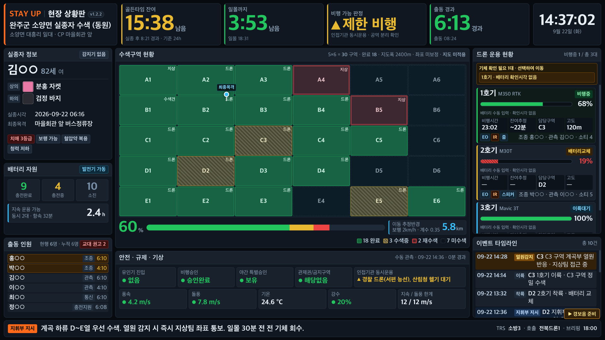
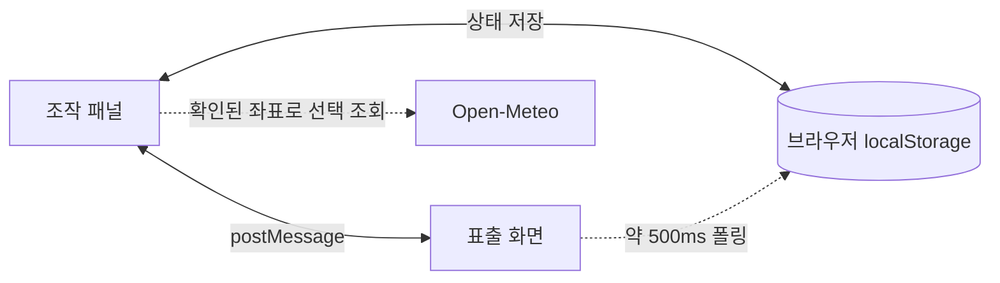

<!-- markdownlint-disable MD013 MD033 -->

# STAY UP 현장 상황판

<p align="center">
  <strong>실종자 수색 현장의 드론·인원·수색구역·안전정보를 한 화면에 모으는 단일 HTML 상황판</strong>
</p>

<p align="center">
  
  
  
  
  
</p>

<p align="center">
  <a href="https://github.com/MuyeongKim/stayup-dash/archive/refs/heads/main.zip"><strong>Download ZIP</strong></a>
  ·
  <a href="#빠른-시작">빠른 시작</a>
  ·
  <a href="#현재-검증-상태">검증 상태</a>
</p>

<p align="center">
  
</p>

<p align="center"><sub>샘플 데이터로 실행한 1600×900 표출 화면 · 실제 인물·출동 정보가 아닙니다.</sub></p>

STAY UP은 현장 조작자가 입력한 내용을 같은 PC의 대형 모니터에 즉시 반영하는 오프라인 우선 대시보드입니다. 앱 실행에 설치·빌드·CDN은 필요하지 않으며, 선택적인 자동 기상 조회만 인터넷을 사용합니다.

> [!CAUTION]
> **현재 버전은 훈련·시연 및 개발 검증용이며, 실출동 단독 운용 승인 전입니다.** 2026-08-23 Chrome 실행 감사에서 확인된 차단 항목 7건은 모두 해소했습니다(아래 [현재 검증 상태](#현재-검증-상태)). 다만 확인은 개발 환경(localhost, Chromium)에서만 이뤄졌으며, 대상 PC·브라우저·스피커·듀얼 모니터에서 인수시험을 마치기 전에는 현장 지휘나 비행 판단의 단일 근거로 사용하지 마십시오.

## 무엇을 한 화면에 모으나

- **상황 개요** — 출동시각, CP, 좌표, TRS 채널, 호출부호, 지휘부 지시
- **실종자 정보** — 인상착의, 최종목격, 특이사항, 이동 추정반경
- **드론 운용** — 기체 상태, 배터리, 담당구역, 고도, 조종·관측, 소티
- **수색구역** — 최대 12×12 격자, 상태·담당, 지도 이미지, 최종목격·발견 핀
- **안전·기상** — 승인, 야간, 유인기 경보, 풍속·돌풍·강수, 일출·일몰
- **활동기록** — 발생시각 기반 타임라인, 정정·취소, JSON 백업, 활동일지 복사

상단 KPI는 실종 후 경과, 일몰, 입력된 안전조건에 따른 비행 판정, 출동 경과를 보여줍니다. 배터리 지속시간과 이동 반경은 입력값을 이용한 **계획 보조용 근사치**이며 실제 텔레메트리나 GIS 분석이 아닙니다.

## 작동 구조



- 조작 패널과 표출 화면은 **동일 PC·동일 브라우저 저장영역**을 사용합니다.
- 창이 직접 연결돼 있으면 `postMessage`, 연결이 끊기면 `localStorage` 폴링으로 상태를 따라갑니다.
- 서버, 로그인, 클라우드 동기화, 기관 간 네트워크 공유는 제공하지 않습니다.
- 자동 기상을 켜면 위·경도가 Open-Meteo 요청에 포함됩니다. 성명·지도·이벤트를 전송하는 기능은 없습니다.

## 빠른 시작

### 비개발자

1. [ZIP 파일](https://github.com/MuyeongKim/stayup-dash/archive/refs/heads/main.zip)을 내려받아 압축을 풉니다.
2. `stayup-dash.html`을 **Chrome 또는 Edge**로 엽니다.
3. 새 브라우저 프로필에서 기능을 볼 때만 `샘플 상황 넣기`를 사용합니다.
4. `표출 화면 열기`를 누르고 새 창을 대형 화면으로 옮깁니다.
5. 표출 창의 `🔊 경보음 준비`를 눌러 시험음과 출력 장치를 확인합니다.

> 운영 데이터가 이미 있다면 샘플을 넣기 전에 반드시 JSON을 내보내십시오. `샘플 상황 넣기`·`전체 초기화`·`직전 작업 복구`는 복구점을 먼저 만들며, 복구점 저장에 실패하면 덮어쓰지 않고 중단합니다.

### Git으로 받기

```bash
git clone https://github.com/MuyeongKim/stayup-dash.git
cd stayup-dash
```

macOS에서는 다음처럼 Chrome으로 직접 열 수 있습니다.

```bash
open -a "Google Chrome" stayup-dash.html
```

## 기본 운용 흐름

1. 상단의 `편집권 보유`, 저장 상태, 표출 연결 상태를 확인합니다.
2. 상황명·수색 장소·출동시각과 위·경도를 입력하고 `현장 좌표 확인 완료`를 누릅니다.
3. 실종자, 기체, 배터리, 인원, 수색격자를 입력합니다.
4. 승인상태와 현장 기상 관측시각·풍속·돌풍·강수를 확인합니다.
5. 기체 전용 버튼과 격자 셀로 실제 상태를 변경하고 이벤트를 기록합니다.
6. 종료 전 JSON을 내보내 실제 파일 생성 여부를 확인하고 활동일지를 복사합니다.
7. 공용 PC에서는 개인정보 완전삭제 후 **열린 관련 창을 모두 닫고**, 다운로드·USB·스크린샷·클립보드 사본도 별도로 정리합니다.

조작 패널은 세로로 길기 때문에, 상단 바의 섹션 칩(`즉시조작 · 상황 · 실종자 · 드론 · 배터리 · 인원 · 수색구역 · 안전·기상 · 데이터`)으로 스크롤 없이 각 구역으로 이동할 수 있습니다. 읽기 전용 상태에서도 이동은 가능합니다.

수색 중 가장 자주 하는 일은 격자 칠하기와 이벤트 한 줄 기록입니다. 지도 위 팔레트에서 칠할 상태·담당을 고르고 칸을 쓸어내리면 됩니다. 자세한 내용은 [수색격자와 지도](#수색격자와-지도)를 참고하십시오.

빠른기록으로 남긴 `이륙·착륙·구역완료·인원교대`는 **타임라인에만** 들어갑니다. 기체·격자·인원의 실제 상태와 어긋나면 `즉시 조작` 구역에 불일치 목록이 뜨고, 버튼 한 번으로 상태를 기록에 맞출 수 있습니다. 자동으로 바꾸지 않는 이유는 오기록이 곧바로 표출 화면에 퍼지는 것을 막기 위해서입니다. 반영할 때는 원래 기록을 중복 생성하지 않고 `정정` 이력만 남깁니다.

화면이 하나뿐이면 표출 화면에서 `Ctrl+E`로 조작 드로어를 열 수 있습니다. 다른 조작 창이 편집권을 보유하면 드로어는 읽기 전용입니다.

## 비행 판정 규칙

| 표시 | 조건 예시 |
| --- | --- |
| `판정 보류` | 좌표 미입력·미확인, 승인 미확인·미신청·신청중, 기상 미확정·필수값 누락, 기상 관측 또는 현장 확인 후 30분 경과, 태양시각 계산 불가 |
| `제한 비행` | 풍속·돌풍이 각 한계의 80% 이상, 강수확률 60% 이상, 승인된 야간, 일몰 30분 전, 인접기관 동시운용 |
| `비행 불가` | 유인기 진입, 관제권·비행금지구역 승인 미완료, 한계 이상 풍속·돌풍, 현재 강수, 야간승인 없는 야간, 비행 중 기체의 조종자 교대 종료 |
| `비행 가능` | 위 보류·주의·불가 조건이 없을 때 |

판정과 안전 항목은 **색과 형태를 함께** 씁니다. 색을 구분하기 어렵거나 프로젝터 색 재현이 나빠도 등급이 읽힙니다.

| 표식 | 뜻 |
| --- | --- |
| ● | 가능 · 정상 |
| ▲ | 제한 · 주의 |
| ■ | 불가 · 위험 |
| ○ | 보류 · 미확인 |

> [!IMPORTANT]
> 화면의 판정은 입력값을 계산한 보조 표시입니다. 드론을 제어하거나 공역·NOTAM·유인기를 자동 감지하지 않으며, 현장 지휘·관계 법령·실제 승인·제작사 제한·현장 계측을 대체하지 않습니다.

`동시 운용 인접기관`을 입력하면 중앙 판정이 `제한 비행`으로 내려가 공역 분리 확인을 요구합니다. 비행 중인 기체의 조종자가 인원 명부에서 교대 종료 상태이면 `비행 불가`로 표시합니다.

> [!NOTE]
> 조종자 연결은 **기체의 조종자 이름과 인원 명부의 성명이 정확히 일치할 때만** 성립합니다. 조종자가 명부에 없으면(외부 인력 등) 판정 근거가 없으므로 반영하지 않으며, 같은 이름이 재투입돼 현행으로 남아 있으면 정상으로 봅니다. 동명이인이 있으면 오탐이 날 수 있습니다.

### 유인기·발견 경보

- `⚠ 유인기 진입`은 화면을 적색으로 바꾸고 비행 불가와 즉시 착륙 지시 문구를 표시하지만, 실제 기체 상태나 비행을 제어하지 않습니다.
- `발견` 이벤트는 표출 화면에 배너를 띄우고 준비된 Web Audio 경보음을 재생합니다.
- 브라우저 자동재생 정책 때문에 표출 창을 열 때마다 사용자가 `경보음 준비`를 눌러야 합니다.

## 수색격자와 지도

격자는 **칠하기** 방식입니다. 지도 위의 팔레트에서 칠할 것을 먼저 고르고, 칸을 찍거나 여러 칸을 쓸어내립니다.

```text
상태   [그대로] [미수색] [수색중] [완료] [재수색]
담당   [그대로] [없음] [드론] [지상] [수색견] [소방대]
```

- 고른 항목만 바뀝니다. `그대로`를 고르면 그 항목은 건드리지 않으므로, 상태를 유지한 채 담당만 바꿀 수 있습니다.
- **여러 칸은 쓸어내려서 한 번에** 바꿉니다. 무전이 `"D3부터 D5까지 훑었습니다"`처럼 연속 구역으로 들어오기 때문입니다.
- 한 번의 쓸기는 타임라인에 **한 줄**로 기록됩니다. 이미 완료였던 칸은 다시 칠해도 기록이 늘지 않습니다.
- 칠한 뒤 빠른기록의 `구역`이 비어 있으면 방금 칠한 첫 칸이 자동으로 채워집니다.
- **직전 쓸기 한 번은 되돌릴 수 있습니다.** 팔레트 아래 `직전 쓸기 취소` 또는 `Ctrl+Z`. 칸을 쓸기 전 값으로 복원하고, 그 쓸기가 남긴 `구역완료` 기록은 지우지 않고 무효 처리하며 정정 이력을 남깁니다. 다른 상황을 불러오거나 상대 창의 상태를 받으면 되돌리기 기록은 버려집니다.
- 키보드는 칸에 포커스를 두고 `Enter`·`Space`로 같은 동작을 합니다.
- 네 상태는 색과 **채움 무늬**로 함께 구분합니다. `미수색`은 점선 테두리에 빈 칸, `수색중`은 사선, `완료`는 진한 채움, `재수색`은 이중 테두리입니다.
- 격자·핀·이동 추정반경은 **지도 이미지의 좌표계에 고정**됩니다. 조작 패널과 표출 화면의 지도틀 모양이 달라도 같은 칸이 같은 지형을 가리킵니다.
- 지도 이미지는 파일 선택, 드래그앤드롭, 클립보드 붙여넣기로 넣을 수 있습니다.
- 가로 1,600px를 넘는 이미지는 최대 1,600px로 축소하고 JPEG 품질 0.82로 저장합니다. HEIC은 브라우저에서 열리지 않을 수 있습니다.
- 이동 추정반경은 사용자가 입력한 지도 가로거리에 맞춘 근사 표시이며 좌표계·지형을 보정하지 않습니다.

| 환경 | 클립보드 캡처 |
| --- | --- |
| macOS | `⌘ + Control + Shift + 4` 후 `⌘V` |
| Windows | `Win + Shift + S` 후 `Ctrl+V` |

macOS의 `⌘ + Shift + 4`는 기본적으로 파일을 저장합니다. 이 경우 저장된 이미지를 끌어다 놓거나 `이미지 파일 선택…`을 사용합니다.

## 기상과 일출·일몰

- 일출·일몰은 확인된 좌표로 브라우저에서 계산합니다. 좌표가 없을 때 다른 지역을 대신 사용하지 않습니다.
- 자동 기상은 확인된 좌표와 인터넷이 있을 때 10분마다 Open-Meteo 모델값을 조회합니다.
- 자동값도 `현장 기상 확인 완료` 전에는 비행 판정에 사용하지 않습니다.
- 한 번 확인한 뒤에는 **자동 갱신이 들어와도 판정이 바뀔 만한 변화가 없으면 확인 상태를 유지합니다.** 다음 중 하나라도 해당하면 확인이 풀리고 다시 눌러야 합니다.
  - 강수 여부가 바뀜
  - 풍속 또는 돌풍이 1 m/s 이상 변동
  - 풍속·돌풍이 설정한 한계의 80% 또는 100% 구간을 새로 넘거나 벗어남
  - 강수확률이 60% 경계를 넘거나 내려감
  - 수동 관측값이 자동 모델값으로 교체됨
- 관측시각이 30분에 도달하거나, **확인한 지 30분이 지나면** 기상은 만료되고 판정을 보류합니다.
- 수동 기상을 입력하면 자동 덮어쓰기를 중지하며, 진행 중이던 늦은 자동응답도 수동값을 덮어쓰지 않습니다.
- Open-Meteo 값은 현장 풍속계나 공식 관측·승인을 대신하지 않습니다.

## 저장·백업·개인정보

| 항목 | 동작과 한계 |
| --- | --- |
| 브라우저 저장 | 현재 브라우저 프로필의 `localStorage`에 평문 저장 |
| 자동 복구 | 변경 상태를 30초 주기로 최대 5개 보조 복구본에 저장. 서로 다른 5개 시점을 보장하지 않음. 저장공간이 부족하면 오래된 세대부터 버려 최소 1개는 남기며, 세대가 줄면 화면에 경고 |
| **자동 보관** | 켜두면 변경분을 지정한 파일에 덮어씁니다. 파일 지정이 불가능한 환경에서는 10분마다 JSON을 내려받습니다. 편집권을 가진 창만 보관합니다 |
| JSON 내보내기 | 상태·이벤트·지도 포함. 다른 위치에 보관할 수 있는 주 백업 수단 |
| JSON 불러오기 | 지원 버전·필수 구조·지도 data URL 외형을 검사. 실제 손상 이미지 디코딩까지 보장하지 않음 |
| 활동일지 복사 | 상황·기체·수색·인원·이벤트·안전정보를 텍스트로 정리해 클립보드에 복사 |
| 완전삭제 | 브라우저의 `stayup.dash.*` 데이터 제거. 다운로드·USB·스크린샷·클립보드 사본은 제거하지 않음 |

활동 타임라인은 그대로 보고서가 됩니다. 브라우저 저장소만 믿으면 프로필 초기화·브라우저 변경·파일 경로 이동 한 번에 출동 기록이 사라지고, 자동 복구본도 같은 저장소라 함께 없어집니다. 그래서 **자동 보관을 기본으로 켜 둡니다.**

- `화면 설정 · 데이터`에서 `보관 파일 지정…`을 누르고 파일을 하나 정하면, 이후 변경은 그 파일에 조용히 덮어씁니다. 창을 새로고침하면 다시 지정해야 합니다.
- 파일 지정이 지원되지 않는 환경에서는 10분마다 JSON을 내려받습니다. 다운로드 폴더에 파일이 쌓이므로 종료 후 승인된 위치로 옮기고 정리하십시오.
- 상단 바의 `보관 N분 전` 표시로 실제로 보관되고 있는지 확인할 수 있습니다.

> [!WARNING]
> 로그인, 암호화, 권한 분리, 서버 백업, 변조방지 감사로그는 없습니다. 파일명·경로 변경, 브라우저 변경, `file://`과 로컬 HTTP 전환은 저장영역을 바꿀 수 있으므로 먼저 JSON을 내보내십시오. 완전삭제 후에는 이전 상태 메시지 재유입을 막기 위해 관련 창을 모두 닫으십시오.

## 현재 검증 상태

실제 Chrome 실행 감사에서 다음 항목은 정상 확인했습니다.

- 초기 공란의 `판정 보류`, 야간·일몰 경계, 승인 상태, 풍속·돌풍 한계, 기상 30분 만료
- 지연된 자동응답의 수동 기상 보호와 실제 Open-Meteo 응답 파싱
- JSON 구조·버전 거부, 낮은 revision 가져오기 승격, 지도 저장 실패 롤백
- 발견 배너·경보음 준비·확인 동기화, 키보드 격자 조작
- 1,440×900·1,600×900 표출과 390px 조작 화면의 수평 오버플로 없음
- Google Chrome 151에서 `file://` 직접 부팅

### 해결된 차단 항목

이전에 **현장 운용 전 차단 항목**으로 기록한 7건은 모두 해소했습니다.

| # | 이전 문제 | 처리 |
| --- | --- | --- |
| 1 | `change`가 조작 패널 전체를 다시 그려 연속 입력·다음 버튼의 첫 조작이 유실 | 빠른기록 입력값을 상태로 분리해 재렌더에도 유지. `change`에서는 저장·표출 갱신만 하고, 패널 재렌더는 포인터가 떨어진 뒤로 미뤄 진행 중인 클릭을 없애지 않음 |
| 2 | 빠른기록의 `이륙·착륙·구역완료·인원교대`가 기체·격자·인원 상태를 바꾸지 않음 | 자동 반영 대신 **불일치 감지 + 원클릭 반영**. 오기록이 곧바로 표출 화면에 퍼지는 것을 막고, 반영 시 원래 기록을 중복 생성하지 않고 `정정` 이력만 남김 |
| 3 | 15초 편집권이 만료되면 같은 창이 회복하지 못함 | 다른 창이 가져가지 않았으면 5초 주기로 스스로 회수하고 화면을 갱신 |
| 4 | 복구점 저장 실패가 덮어쓰기를 중단시키지 않음 | `직전 작업 복구`·`샘플 상황 넣기`·`전체 초기화` 모두 복구점 실패 시 중단 |
| 5 | 완전삭제 후 이전 epoch 상태를 표출 화면이 다시 받아들임 | 상태 수신 시 epoch 대조. 저장에 실패한 상태는 상대 창으로 내보내지 않음 |
| 6 | 발생시각 기본값이 입력줄 렌더 시각 | 손대기 전까지 `자동`이며 기록하는 순간의 현재 시각으로 확정. 직접 입력한 소급 시각은 재렌더 후에도 보존 |
| 7 | 조종자 교대 종료·인접기관이 중앙 비행 판정에 미연결 | 비행 중 기체의 조종자가 교대 종료면 `비행 불가`, 인접기관 동시운용은 `제한 비행`. 조건은 [비행 판정 규칙](#비행-판정-규칙) 참조 |

### 함께 수정한 문제

표출 화면과 조작 패널을 실제로 띄워 확인하는 과정에서 아래 문제도 발견해 수정했습니다.

#### 안전·경보

- **발견 경보의 `확인` 버튼을 누를 수 없었습니다.** 우상단 `🔊 경보음 준비` 칩이 배너보다 위에 겹쳐 클릭을 가로챘습니다. 경보음을 미리 준비해 칩이 사라진 상태에서는 정상이었기 때문에 이전 감사에서 드러나지 않았습니다. 칩을 우하단으로 옮겼습니다.
- **경보 배너가 헤더 KPI 전체를 가렸습니다.** 발견·유인기 경보가 뜨는 순간 골든타임·일몰·비행 판정·시계가 배너 뒤로 숨었습니다. 이제 배너 높이만큼 판을 내립니다.
- **표출 화면이 조작 패널과 끊긴 상태에서는 `확인`이 조용히 실패했습니다.** 이제 버튼에 `조작 패널에서 확인하세요`를 표시합니다.
- **과거 시각으로 소급 입력한 `발견`은 경보가 울리지 않았습니다.** 경보 대상 선택을 사건 발생시각이 아닌 기록시각 기준으로 바꿨습니다.
- **상태가 색으로만 구분됐습니다.** 비행 판정 점, 수색격자 셀, 안전 항목, 배터리 위험 구간이 모두 색상 차이만 있었습니다. 적록색약(한국 남성 5~6%)인 운영요원에게는 `비행 가능`과 `비행 불가`가 같은 회색 점이고, 완료 구역과 재수색 구역이 같은 칸입니다. 프로젝터 색 재현이 나쁠 때도 같은 문제가 납니다. 형태·무늬 표식을 더해 색 없이도 읽히게 했으며, 적록색약 2형 시뮬레이션(Viénot 행렬)으로 확인했습니다.
- **브랜드 주황(`#FF6A1A`)과 경고 앰버(`#F5A524`)가 색상환에서 17도 차이라 대형 스크린에서 같은 신호로 읽혔습니다.** 경고를 `#E8B931`로 옮겨 분리하고, 액센트는 정체성 전용으로 두어 상태 표시에서 뺐습니다(실종자 나이 표기 포함).
- **이벤트 한도(5,000건)에 도달하면 기체 상태가 기록 없이 바뀌었습니다.** 이제 변경 자체를 거부합니다.
- **자동 기상 갱신이 10분마다 판정을 `판정 보류`로 되돌렸습니다.** 갱신에 성공할 때마다 확인 상태를 풀었기 때문에, 자동 기상을 켜면 10분마다 `현장 기상 확인 완료`를 다시 눌러야 했습니다. 이는 단순한 번거로움을 넘어 **운영요원이 안전 확인 버튼을 뜻 없이 누르도록 길들이는** 문제였습니다. 이제 판정 등급을 바꿀 만한 변화가 있을 때만 확인을 풀고, 확인 자체는 30분 뒤 만료됩니다.

#### 개인정보·저장

- **창 간 상태 전달의 `postMessage` 대상 출처가 `*`였습니다.** 로컬 HTTP로 서빙하면 실제 출처로 제한합니다(`file://`은 출처가 `null`이라 제한할 수 없습니다).
- **손상된 저장 사본(`*.corrupt.*`)이 무한 누적됐습니다.** 하나만 유지하며, 사본 저장에 실패해도 손상된 키는 반드시 치웁니다.
- **이벤트가 한도에 가까우면 복구본 5세대가 브라우저 할당량을 넘겨 전부 실패했습니다.** 세대를 줄여서라도 최근 것을 남깁니다.

#### 수색격자

- **조작 패널과 표출 화면의 격자가 서로 다른 지형을 가리켰습니다.** 지도틀 종횡비가 조작 패널은 `1.60` 고정인데 표출 화면은 해상도에 따라 `1.70~2.08`로 달랐고, 안전 카드에 글자를 더 넣는 것만으로도 `2.08 → 2.14`로 움직였습니다. `object-fit:cover`가 그 차이를 크롭으로 흡수해서, 16:9 캡처 기준 조작 패널은 좌우 10%가, 표출 화면은 상하 15%가 잘렸습니다. 운영요원이 `C3 = 계곡 하류`로 맞춰도 대형 스크린의 C3는 다른 곳이었습니다. 격자·핀·추정반경을 컨테이너가 아닌 **이미지 좌표계**에 고정해 해결했습니다. 이동 추정반경 원도 이제 `지도 가로 실거리` 기준과 실제로 일치합니다.
- **상태 순환이라 칸마다 클릭 수가 달랐습니다.** `(상태+1)%4` 순환이어서 몇 번 눌러야 하는지 알려면 각 칸의 현재 색을 먼저 확인해야 했고, 무전을 들으면서 여섯 칸을 고치는 데 약 17번의 클릭이 필요했습니다. 게다가 완료를 지날 때마다 기록이 남아 **오클릭을 되돌리는 과정이 가짜 `구역완료` 기록을 만들었습니다.** 칠하기 방식으로 바꿔 같은 작업이 5동작이 되었고, 오조작은 다시 칠하면 끝나며 중복 기록도 생기지 않습니다.

#### 기록 보존

- **활동 타임라인이 브라우저 저장소에만 있었습니다.** 운영요원이 `JSON 내보내기`를 누르기 전까지 출동 기록이 `localStorage` 밖으로 나가지 않았고, 자동 복구본도 같은 저장소라 프로필 초기화 한 번이면 함께 사라졌습니다. 보고서가 되는 기록을 사람 기억에 맡기던 구조입니다. 자동 보관을 넣어 지정한 파일에 덮어쓰거나(파일 지정 불가 시 10분마다 다운로드) 자동으로 밖에 남깁니다.

#### 표시·성능

- **저장 경고 띠가 조작 패널 상단 바(`표출 화면 열기`·`편집권 가져오기`)를 덮었습니다.** 하단으로 옮겼습니다.
- **지휘부 지시가 티커에 두 번 겹쳐 보였습니다.** 글자 수 대신 실제 넘침을 기준으로 흘립니다.
- **표출 격자 뒤로 조작 안내문이 비쳐 읽히지 않는 얼룩이 됐습니다.** 안내문은 조작 패널에만 표시하고, 표출은 카드 헤더에 `지도 미적용`으로 알립니다.
- **KPI의 큰 숫자가 우측 현재시각과 혼동됐습니다.** `남음`·`경과` 접미사를 붙였습니다.
- **500ms 동기화 폴링이 매번 상태 전체를 파싱·정규화·직렬화했습니다.** 저장 원문이 지난번과 같으면 건너뜁니다.
- **발견 배너를 1초마다 다시 그려 `확인` 버튼이 매초 새로 만들어졌습니다.** 내용이 바뀔 때만 그립니다.
- **지도 이미지를 크기 제한 없이 읽었습니다.** 25 MiB 상한을 뒀습니다.
- **기상 자동 갱신 플래그가 영구히 잠길 수 있었습니다.**

### 회귀 검사로 고정한 항목

위 수정들은 [tests/regression.html](./tests/regression.html)에 47건으로 고정해 두었습니다. 이 대화에서 손으로 확인한 것들이 다음 변경 때 조용히 깨지지 않도록 하는 장치입니다. 자세한 실행 방법은 [개발자 메모](#회귀-검사)를 참고하십시오.

### 남은 인수시험

위 수정의 확인은 **개발 환경(localhost, Chromium)**에서 이뤄졌습니다. 대상 PC의 Chrome·Edge와 `file://` 직접 실행, 물리 스피커 음량, 기관 업무망 정책, 실제 듀얼 모니터, 장시간 절전·복귀는 대상 장비에서 별도 인수시험이 필요합니다.

## 데이터 한계

| 항목 | 한계 |
| --- | ---: |
| 이벤트 | 5,000건 |
| JSON 입력 파일 | 6 MiB 이하. 브라우저 잔여 저장공간에 따라 더 작은 파일도 실패 가능 |
| 지도 원본 파일 | 25 MiB 이하. 초과 시 읽기 전에 차단 |
| 지도 data URL | 축소·변환 후 약 3 MiB 이하 |
| 격자 | 최대 12×12 |
| 드론 | 불러오기·재시작 정규화 기준 50대 |
| 인원 | 불러오기·재시작 정규화 기준 200명 |
| 기상 관측 유효시간 | 관측시각 기준 30분 미만 |
| 기상 확인 유효시간 | `현장 기상 확인 완료`를 누른 뒤 30분 미만 |
| 자동 기상 | 10분 주기, 요청 12초 타임아웃 |
| 편집권 | 15초 임대, 5초 갱신 |
| 표출 연결 | 마지막 응답 후 7초에 미연결 표시 |

## 단축키

| 키 | 표출 화면 동작 |
| --- | --- |
| `F` | 전체화면 켜기·끄기 |
| `Ctrl+E` | 조작 드로어 열기·닫기 |
| `Esc` | 조작 드로어 닫기 |
| `+` / `-` | 표출 배율 조절 |
| `Ctrl+Z` | 직전 쓸기 취소 (입력칸에 있을 때는 동작하지 않음) |

격자 칸에 포커스를 두고 `Enter`·`Space`를 누르면 팔레트에서 고른 대로 칠해집니다.

## 개발자 메모

런타임은 [stayup-dash.html](./stayup-dash.html) 하나이며 라이브러리·CDN·npm·빌드 의존성이 없습니다. 로컬 미리보기는 다음처럼 실행할 수 있습니다.

```bash
python3 -m http.server 8899 --bind 127.0.0.1
```

브라우저에서 `http://127.0.0.1:8899/stayup-dash.html`을 엽니다. 로컬 HTTP와 `file://`은 저장영역이 다를 수 있으므로 운영 데이터와 혼용하지 마십시오.

### 회귀 검사

[tests/regression.html](./tests/regression.html)을 로컬 HTTP로 열면 앱을 iframe에 띄워 내부 함수를 직접 호출하며 47건을 검사합니다. 실제 브라우저에서 돌아가므로 레이아웃·포인터·저장소까지 함께 확인됩니다.

```bash
python3 -m http.server 8899 --bind 127.0.0.1
```

브라우저에서 `http://127.0.0.1:8899/tests/regression.html`을 엽니다. `file://`에서는 iframe이 교차 출처로 취급돼 동작하지 않습니다.

검사 범위는 저장·개인정보(세대 대조, 저장 실패 시 전파 차단), 비행 판정(조종자 부재·인접기관), 기상 확인 유지·만료, 발견 경보(소급 입력·형태 인코딩), 수색격자(이미지 좌표계 고정·칠하기·중복 기록 방지·쓸기 되돌리기), 조작 패널(첫 클릭 유실·입력 유지·발생시각 확정), 기록↔상태 불일치, 자동 보관, 복구점 중단입니다.

코드를 고친 뒤에는 이 페이지를 먼저 돌려 보십시오. **전체 통과가 아니면 커밋하지 마십시오.**

인라인 스크립트 구문만 빠르게 확인하려면 Node.js가 있는 환경에서 다음을 실행할 수 있습니다.

```bash
node -e "const fs=require('fs');const s=fs.readFileSync('stayup-dash.html','utf8');const m=s.match(/<script>([\s\S]*?)<\/script>/);if(!m)throw Error('script missing');new Function(m[1]);console.log('inline script syntax: OK')"
```

### 자동 버전 정책

- [VERSION](./VERSION)이 앱 릴리스 버전의 기준이며 [stayup-dash.html](./stayup-dash.html)의 `APP_VERSION`과 항상 같아야 합니다.
- 사용자가 `main`에 업데이트를 푸시할 때마다 GitHub Actions가 기본적으로 패치 버전을 올립니다. 예: `v1.0.1 → v1.0.2`.
- 커밋 메시지에 `[부버전]`을 넣으면 minor, `[주버전]`을 넣으면 major가 증가합니다.
- 자동화는 `앱 버전 vX.Y.Z 자동 업데이트`라는 한글 커밋과 동일한 annotated Git 태그를 함께 생성합니다.
- `STATE_VERSION`과 `stayup.dash.*` 저장 키는 JSON·브라우저 데이터 호환성용입니다. 일반 앱 업데이트에서는 변경하지 않습니다.

버전 파일과 앱 상수의 동기화는 다음 명령으로 확인할 수 있습니다.

```bash
node scripts/version.mjs check
```

```text
stayup-dash/
├── .github/workflows/auto-version.yml
├── scripts/
│   ├── auto-version.sh
│   └── version.mjs
├── tests/
│   └── regression.html
├── VERSION
├── stayup-dash.html
├── README.md
└── assets/readme/dashboard-preview.png
```

## 라이선스

현재 별도 `LICENSE` 파일이 없습니다. 공개 저장소 열람·복제가 재사용 허가를 의미하지 않으므로 배포·수정·재사용 범위는 저장소 소유자에게 확인하십시오.
